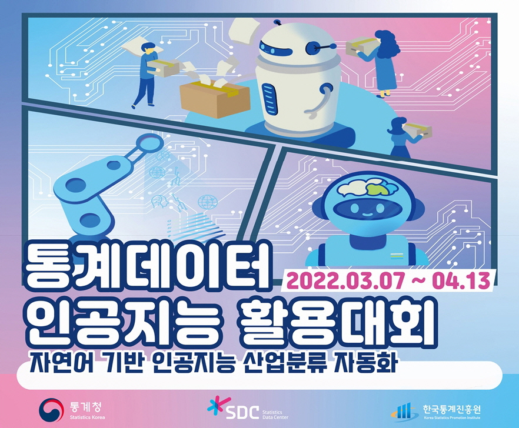

# <b>2022 통계데이터 인공지능 활용대회</b>

## <b>“자연어 기반 인공지능 산업분류 자동화”</b>

자연어 기반의 통계데이터를 인공지능으로 자동 분류하는 기계학습 모델 발굴로 통계 데이터 활용 저변 확대

### <b>공모분야</b>
산업분류 자동화 인공지능 모델 개발

### <b>필수 분석 조건</b>
Python 또는 R 언어로 자연어 텍스트 마이닝 및 인공지능 분류 모델 구축

### <b>제출물</b>
- 산업분류 예측값 (csv파일)
- 작성 코드
- 코드실행 로그
- 코드설명자료 (이메일제출, 2페이지 내, 2차 심사 대상자)

### <b>활용 데이터</b>
전국사업체조사 샘플데이터
- "1. 실습용자료.txt"
- "2. 모델개발용자료.txt"

### <b>기여자</b>
- 정희택
- 김상구
- 주지훈

### <b>작업 내역</b>
+ 22-03-22
  1. preprocessing 과정에서 pykospacing 사용 띄어쓰기 적용 -> 폐기 (과도한 시간 소요)
  1. mecab user dictionary 생성
  1. visual EDA
  1. 한국표준산업분류 dictionary 생성
  1. LSTM 모델 적용 학습 및 평가 수행

+ 22-03-27
  1. okt 라이브러리를 활용 토크나이징

+ 22-03-28
  1. okt 토큰화된 데이터 LSTM 사용 학습 및 결과 분석 -> 폐기

+ 22-04-05
  1. Decision Tree Classifier 시도 -> 폐기 (정확도 낮음)

+ 22-04-10
  1. 대분류 -> 중분류 -> 소분류 예측 결과 파이프라이닝 개선 -> 폐기 (정확도 낮음)

+ 22-04-11
  1. preprocessing 과정에서 spellchecker 적용 -> 폐기 (과도한 시간 소요)

+ 22-04-12
  1. colab GPU 사용 koBERT 모델 학습 -> 폐기 (사양 부족으로 인한 과도한 시간 소요 및 정확도에 별 차이 없음)

+ 22-04-13
  1. mecab user dictionary 업데이트
  2. 실행 로그 기록
  3. 제출용 파일 생성
